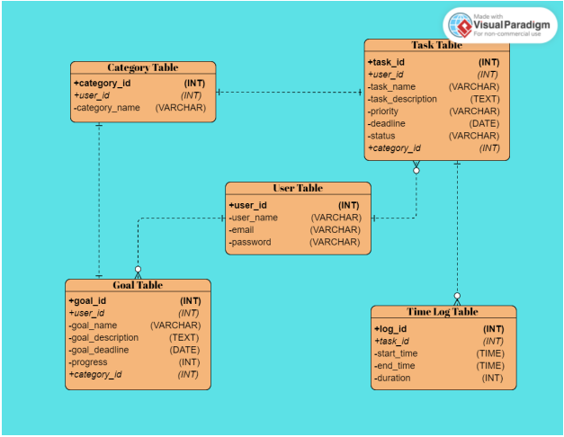

<table align="center">
  <tr>
    <td align="center" bgcolor="#050505" style="padding: 20px;">
      
    </td>
  </tr>
</table> 

---

### Project Overview
**BeProductive!** is a **Daily Productivity Tracker** designed to help users manage tasks, track time, set goals, and monitor their progress in a simple and intuitive way.  

---

### Background
In today's busy world, people are always looking for ways to manage their time better and get more done. The idea for creating a Daily Productivity Tracker website comes from this need. Since many of us rely on digital tools to track our tasks, there's an opportunity to make a website that not only helps with tasks but also gives advice on how to be more productive.  

---

### Objectives
- Create a website that is easy to use.
- Help users manage tasks efficiently and use their time wisely.
- Track time spent on each task.
- Set and monitor goals (daily, weekly, monthly).
- Visualize productivity data with charts and graphs. 
- Provide reminders for important deadlines.
- Offer a seamless, easy-to-use interface.

---

### Features / Scope
The website will allow users to:  
- Sign up and log in securely  
- Add, edit, and delete tasks  
- Task priority and status management  
- Set goals for the day, week, or month and track progress  
- Track the time spent for each task  
- Visual charts and graphs for productivity insights  
- Receive reminders for important tasks or deadlines    

---

### Target Audience
- Professionals aiming for better time management  
- Students managing academic and personal tasks  
- Freelancers and entrepreneurs  
- Anyone interested in tracking and improving productivity  

---

### Significance
Creating the Daily Productivity Tracker website is important because it provides a comprehensive solution for increasing productivity. By combining task management, time tracking, and goal setting tools, the website simplifies daily routines and helps users make smarter decisions about their time. Ultimately, it helps individuals reach their goals more efficiently.

---

### Constraints
Some challenges in building the Daily Productivity Tracker include: 
- Limited budget and resources  
- Time constraints for development
- Limited manpower  
- Technical requirements  
- Privacy and security compliance  

---

### Stakeholders
Key stakeholders include:  
- The development team building the website. 
- Users who will use the website to organize tasks.  
- Clients, investors, or anyone interested in the project's success. 

Good communication and teamwork among stakeholders are crucial for the success of the project.  

---

<table align="center">
  <tr>
    <td align="center" bgcolor="#050505" style="padding: 20px;">
      
    </td>
  </tr>
</table> 

---

### Database Schema (SQL)

```sql
-- Create Database
-- name = be_productive_webapp


-- Create Category table
CREATE TABLE category (
    cat_id INT AUTO_INCREMENT PRIMARY KEY,
    cat_name VARCHAR(10)
);

INSERT INTO category (cat_name)
VALUES ('Study'), ('Work'), ('Self');

-- Create Users table
CREATE TABLE users (
    user_id INT AUTO_INCREMENT PRIMARY KEY,
    user_name VARCHAR(255) NOT NULL,
    email VARCHAR(255) NOT NULL,
    password VARCHAR(255) NOT NULL
);

-- Create Task table
CREATE TABLE task (
    task_id INT AUTO_INCREMENT PRIMARY KEY,
    user_id INT,
    task_name VARCHAR(255) NOT NULL,
    task_description TEXT,
    priority ENUM('High', 'Medium', 'Low') NOT NULL,
    deadline DATETIME,
    status ENUM('Pending', 'In Progress', 'Completed') NOT NULL,
    cat_id INT,
    FOREIGN KEY (user_id) REFERENCES users(user_id),
    FOREIGN KEY (cat_id) REFERENCES category(cat_id)
);

-- Create TimeLog table
CREATE TABLE timeLog (
    log_id INT AUTO_INCREMENT PRIMARY KEY,
    task_id INT,
    start_time DATETIME NOT NULL,
    end_time DATETIME NOT NULL,
    duration INT,
    FOREIGN KEY (task_id) REFERENCES task(task_id)
);

-- Create Goal table
CREATE TABLE goal (
    goal_id INT AUTO_INCREMENT PRIMARY KEY,
    user_id INT,
    goal_name VARCHAR(255) NOT NULL,
    goal_description TEXT,
    goal_deadline DATETIME,
    progress INT,
    cat_id INT,
    FOREIGN KEY (user_id) REFERENCES users(user_id),
    FOREIGN KEY (cat_id) REFERENCES category(cat_id)
);
